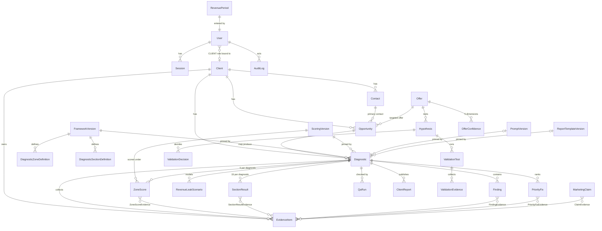

# RIBM Revenue Spine App OS — Domain Model (MVP 1)

The canonical schema is `prisma/schema.prisma`. This document explains it: what exists, how the pieces relate, and which rules the code must never break.

Spine covered in MVP 1:

`Revenue Target → Opportunity → Evidence → Diagnosis → QA → Client Report → Client Decision`, with `Validation` and the `Claim Registry` recording what the business has actually proven.

Out of MVP 1 (schema intentionally absent): Market, Competitor, Intervention, Prescription, Deal, Proposal, Objection, Install, Outcome, OptimizationCycle, Benchmark, CaseStudy. See DECISIONS C-18.

---

## 1. Entity map

---

## 2. Enums

| Enum | Values | Source |
|---|---|---|
| `Role` | ADMIN, OPERATOR, SALES_ADVISOR, CONTRACTOR, CLIENT | BD §5, 04 §3 |
| `EvidenceState` | VERIFIED, CLIENT_PROVIDED, ASSUMPTION, NOT_VERIFIED | BD §1, §10; 04 §7 |
| `EvidenceType` | WEBSITE_OBSERVATION, SCREENSHOT, CLIENT_STATEMENT, DOCUMENT, ANALYTICS_EXPORT, CALL_NOTE, THIRD_PARTY_LISTING, OTHER | operational vocabulary, extendable |
| `OpportunityStage` | TARGET, CONTACTED, CONVERSATION, QUALIFIED, DIAGNOSTIC, PRESCRIPTION_PENDING, PROPOSAL, WON, LOST, DEFERRED, DISQUALIFIED | BD §8 (C-06) |
| `QualificationState` | UNASSESSED, IN_PROGRESS, QUALIFIED, DISQUALIFIED | BD §8 |
| `DemandSourceState` | UNKNOWN, NONE, WEAK, MEANINGFUL | 01 §13, 04 §28 (C-20) |
| `AuthorityState` | UNKNOWN, PARTIAL, CONFIRMED | 04 §28 "require authority before proposal" |
| `UrgencyLevel` | UNKNOWN, LOW, MEDIUM, HIGH | BD §8 |
| `AuthorityLevel` | UNKNOWN, DECISION_MAKER, INFLUENCER, GATEKEEPER | C-19 (proposed) |
| `DecisionRole` | UNKNOWN, ECONOMIC_BUYER, CHAMPION, TECHNICAL_EVALUATOR, END_USER | C-19 (proposed) |
| `OfferStatus` | PRIMARY, TEST, POST_SALE, DEFERRED, RETIRED | BD §2, 04 §28 |
| `OfferValidationState` | TESTING, VALIDATED | 00 |
| `QaStatus` | NOT_READY, READY_FOR_QA, QA_FAILED, QA_PASSED, FINALIZED | BD §13 |
| `SectionStatus` | NOT_STARTED, DRAFT, COMPLETE | MVP 1 workflow |
| `ReportStatus` | DRAFT, PUBLISHED, WITHDRAWN | MVP 1 workflow |
| `ValidationDecisionState` | DOUBLE, TWEAK, PAUSE, KILL | BD §7, 01 §9 |
| `ConfidenceDimension` | DEMAND, WILLINGNESS_TO_PAY, DELIVERY, OUTCOME, RECURRING_VALUE | BD §7, 04 §28 |
| `ConfidenceLevel` | LOW, MEDIUM, HIGH | BD §7 |
| `HypothesisStatus` | DRAFT, RUNNING, CONCLUDED | MVP 1 workflow |
| `ClaimType` | OUTCOME, AVERAGE, MARGIN, SPEED, TESTIMONIAL, BENCHMARK | BD §15, 04 §28 |
| `ClaimStatus` | DRAFT, VERIFIED, EXPIRED, BLOCKED | BD §15 |
| `VersionStatus` | DRAFT, ACTIVE, RETIRED | BD §16 |
| `AuditAction` | CREATE, UPDATE, DELETE, STATE_CHANGE, SCORE_CHANGE, EVIDENCE_STATE_CHANGE, FINALIZE, PUBLISH, APPROVE, PERMISSION_CHANGE, FRAMEWORK_CHANGE, LOGIN, LOGOUT, LOGIN_FAILED | BD §17 |

---

## 3. Entities

### Identity and access
- **User**: `email` (unique, lower-cased), `name`, `passwordHash`, `role`, `clientId?` (required iff role = CLIENT), `active`.
- **Session**: `tokenHash` (SHA-256 of the cookie token, unique), `userId`, `expiresAt`, `createdAt`, `ipHash?`, `userAgent?`.

### Commercial
- **Client**: `legalName`, `displayName`, `website?`, `industry?`, `market?`, `location?`, `businessModel?`, `primaryObjective?`, `notes?` (internal), timestamps.
- **Contact**: `clientId`, `name`, `title?`, `email?`, `phone?`, `authorityLevel`, `decisionRole`.
- **Opportunity**: `clientId`, `primaryContactId?`, `offerId?`, `stage`, `businessObjective?`, `problemHypothesis?`, `economicContext?`, `currentSystems?`, `urgency`, `authorityState`, `budgetSignal?`, `demandSourceState`, `qualificationState`, `nextAction?`, `nextActionDate?`, `disqualificationReason?`, `stageChangedAt`.
- **Offer**: `name` (unique), `aliases[]`, `status`, `validationState`, `description?`, `edition?`.
- **RevenuePeriod**: one row per month. Holds Command inputs: `periodStart`, `cashTarget`, `collectedToDate`, `contractedNearTerm`, `recurringRevenue`, `avgFirstSaleRevenue?`, the trailing counts (`decidedProposals`, `wonProposals`, `qualifiedConversations`, `proposalsFromConversations`), `openOpportunityCount`, `founderCapacityHours?`, `founderCommittedHours?`, `enteredById`. Each rate is derived from its counts and never typed in directly. That is what lets sufficiency be checked (C-12).

### Methodology versions
- **FrameworkVersion**: `code` (unique, e.g. `RS-FW-2.1`), `label`, `status`, `notes`, `adoptedAt?`, `adoptedById?` (C-02).
- **ScoringVersion**: `code`, `status`, `rules` (JSON: score thresholds, sufficiency threshold) (C-12, C-13).
- **PromptVersion**: `code`, `purpose`, `promptText` (**internal only**), `checksum`, `status`.
- **ReportTemplateVersion**: `code`, `status`, `sections` (JSON: ordered section keys).
- **DiagnosticZoneDefinition**: `frameworkVersionId`, `key`, `name`, `position`, `description`. Unique on (`frameworkVersionId`, `key`).
- **DiagnosticSectionDefinition**: `frameworkVersionId`, `number` (1–15), `key`, `name`, `description`. Unique on (`frameworkVersionId`, `number`).

### Diagnostic
- **Diagnostic**: `clientId`, `opportunityId?`, `title`, `qaStatus`, the pinned version IDs (`frameworkVersionId`, `scoringVersionId`, `promptVersionId?`, `reportTemplateVersionId?`), intake fields, narrative fields (`executiveDiagnosis`, `biggestConstraint`, `revenueSpineStrength`, `recommendedInterventionDirection`, `implementationReadiness`, `measurementPlan`, `nextDecision`, `finalRecommendation`), `internalNotes` (never client-visible), `finalizedAt?`, `finalizedById?`.
- **ZoneScore**: `diagnosticId`, `zoneDefinitionId`, `score?` (1–10), `diagnosis`, `primaryWeakness`, `recommendedInterventionClass`, `confidence`, `scoringVersionId`, `justification?`. Evidence is linked via **ZoneScoreEvidence**.
- **SectionResult**: `diagnosticId`, `sectionDefinitionId`, `status`, `findingsSummary`. Evidence via **SectionResultEvidence**.
- **Finding**: an atomic, material diagnostic claim. `diagnosticId`, `sectionResultId?`, `statement`, `isMaterial`, `evidenceState`, `clientFacing`. Evidence via **FindingEvidence**. QA's "claims linked to evidence" check runs over Findings.
- **EvidenceItem**: `clientId`, `diagnosticId?`, `type`, `source`, `sourceUrl?`, `capturedText?`, `fileRef?`, `evidenceState`, `operatorNotes?` (internal), `capturedAt`, `capturedById`, `stateChangedAt?`, `stateChangeReason?`.
- **RevenueLeakScenario**: `diagnosticId`, `label`, `averageClientValue` + `averageClientValueState`, `missedBookingsPerWeek` + `missedBookingsState`, `weeksPerMonth` (default 4) + `weeksPerMonthState` (default ASSUMPTION), `estimatedMonthlyExposure` (derived and stored), `resultState` (derived), `notes`.
- **PriorityFix**: `diagnosticId`, `rank`, `problem`, `fix`, `interventionClass`, `zoneKey?`, `effort?`. Evidence via **PriorityFixEvidence**.
- **QaRun**: `diagnosticId`, `runById`, `resultStatus` (QA_PASSED / QA_FAILED), `checks` (JSON array of `{key, passed, detail}`), `attestations` (JSON), `notes`, `createdAt`.
- **ClientReport**: `diagnosticId`, `clientId`, `status`, `snapshot` (JSON, frozen), `frameworkVersionId`, `scoringVersionId`, `promptVersionId?`, `reportTemplateVersionId`, `publishedAt?`, `publishedById?`.

### Validation
- **Hypothesis**: `offerId?`, `icp`, `pain`, `proposedIntervention`, `offer`, `priceScope`, `channel`, `expectedBehavior`, `startDate`, `endDate`, `sampleTarget`, `successThreshold`, `killCondition`, `status`.
- **ValidationTest**: `hypothesisId`, `startDate`, `endDate`, `sampleSizeTarget`, `outreachCount`, `conversations`, `qualifiedConversations`, `commercialAsks`, `advancedToNextStep`, `paidEngagements`, `notes`.
- **ValidationEvidence**: `testId`, `buyerLanguage` (exact quote), `outcome`, `objections?`, `paymentEvent` (bool), `paymentAmount?`, `source`, `evidenceState`, `capturedAt`.
- **ValidationDecision**: `hypothesisId`, `decision`, `rationale`, `decidedById`, `decidedAt`.
- **OfferConfidence**: `offerId`, `dimension`, `level`, `basis` (text), `assessedAt`. Unique on (`offerId`, `dimension`).
- **Offer economics** (fields on `Offer` for MVP 1): `positiveUnitEconomics` (boolean, default false) and `unitEconomicsBasis` (text). A true value with a written basis is required before VALIDATED (00). Per-engagement economics (delivery hours, contractor/software/processing cost, realized margin — 04 §28) arrive with Installs in MVP 3.

### Claims and audit
- **MarketingClaim**: `statement`, `claimType`, `isQuantitative` (derived on save; the operator can set it but cannot clear it), `cohortDefinition?`, `timeWindow?`, `calculationMethod?`, `ownerId`, `approvedById?`, `approvedAt?`, `reviewDate?`, `status`. Evidence via **ClaimEvidence**.
- **AuditLog**: `userId?`, `entityType`, `entityId`, `action`, `before?` (JSON), `after?` (JSON), `reason?`, `createdAt`. Append-only, enforced by a database trigger that rejects UPDATE and DELETE. Consequence: a user with audit history cannot be hard-deleted (the `SetNull` would be an UPDATE); users are deactivated (`active = false`) instead. Secrets and `promptText` are redacted before write.

---

## 4. Invariants (must always hold)

Each invariant names where it is enforced: **D** = pure domain function (unit-tested), **S** = server service/action, **DB** = database constraint.

### Evidence integrity
1. **E1** Evidence state changes are explicit events. A change *to* VERIFIED from ASSUMPTION or NOT_VERIFIED requires an actor with `evidence:verify`, a reason, and a verification source (URL, file, or observation note). **D** `assertEvidenceStateChange` · **S** audit-logged as EVIDENCE_STATE_CHANGE.
2. **E2** No code path assigns VERIFIED as a default or bulk transformation. Imports and generators default to NOT_VERIFIED, or ASSUMPTION for scenario inputs. **D** / code review.
3. **E3** CLIENT_PROVIDED is shown with its source label wherever it appears client-facing (04 §7).
4. **E4** Deleting an evidence item that a score, finding, fix, or claim references is blocked. The item can be superseded instead. **DB** (`onDelete: Restrict` on join tables) · **S**.
5. **E5** NOT_VERIFIED renders as "Not verified from available evidence."

### Scoring
6. **S1** A score is an integer from 1 to 10, or null (not yet scored). **D** + **DB** CHECK.
7. **S2** Score ≥7 needs at least one VERIFIED evidence link. Score ≥9 needs at least two VERIFIED links plus a justification. Rule parameters come from the pinned ScoringVersion (C-13). **D** `validateScore`.
8. **S3** Every ZoneScore stores `scoringVersionId`. **DB** NOT NULL.
9. **S4** Score edits are audit-logged with before and after values (SCORE_CHANGE). **S**.

### Diagnostic lifecycle
10. **L1** QA status transitions follow this machine. **D** `assertQaTransition`.
    - NOT_READY → READY_FOR_QA
    - READY_FOR_QA → QA_PASSED | QA_FAILED | NOT_READY
    - QA_FAILED → READY_FOR_QA | NOT_READY
    - QA_PASSED → FINALIZED | NOT_READY (edits reopen it)
    - FINALIZED → (none; terminal)
11. **L2** QA_PASSED can be set only by a QA run whose checks all pass. There is no manual override in MVP 1. **D** `evaluateDiagnosticQa`.
12. **L3** A FINALIZED diagnostic is immutable. Corrections create a new Diagnostic that references the original. **S**.
13. **L4** Finalizing a diagnostic requires all four version IDs to be present, and they are then frozen. **D** `assertFinalizable`.
14. **L5** A ClientReport can be published only when its diagnostic is QA_PASSED or FINALIZED. **D** `assertReportPublishable` · **S**.
15. **L6** A published report's snapshot is never mutated (ADR-009).

### Revenue math
16. **R1** Revenue Gap = Cash Target − Collected − Contracted Near-Term. It may be negative, which means the target is covered. **D**.
17. **R2** Required Wins/Proposals/Conversations are computed only when every input rate's denominator meets the sufficiency threshold. Otherwise the status is `INSUFFICIENT_DATA` with **no** number. **D** `computeRevenueCommand`.
18. **R3** Scenario-range outputs carry the label ASSUMPTION and the rates they were computed from. **D**.
19. **R4** Required counts round **up** (you cannot hold 3.2 conversations). **D**.
20. **R5** Leak exposure = ACV × Missed/Week × Weeks/Month. The result's evidence state is the weakest of its inputs (VERIFIED > CLIENT_PROVIDED > ASSUMPTION). Any NOT_VERIFIED input means no number. It is always labeled "Estimated revenue exposure." **D** `computeLeakExposure`.

### Validation and claims
21. **V1** Confidence per dimension comes from counts using 04 §28's table. It is never a single overall probability. **D** `confidenceFor`.
22. **V2** `Offer.validationState = VALIDATED` only when DEMAND, WTP, DELIVERY, and OUTCOME are all HIGH and positive unit economics are recorded (00). **D** `deriveOfferValidationState`.
23. **V3** Each hypothesis requires a start date, end date, sample target, success threshold, and kill condition before it can be RUNNING. **D** (Zod).
24. **C1** A quantitative claim (containing digits, %, or "×"/"x" multipliers) can become VERIFIED only with: at least one evidence item, all in state VERIFIED; a cohort definition (required for AVERAGE, BENCHMARK, and any percentage); a time window; a calculation method; and approval by an ADMIN. **D** `assertClaimVerifiable`.
25. **C2** A claim past its `reviewDate` is treated as EXPIRED for publication, whatever its stored status. **D** `effectiveClaimStatus`.

### Access
26. **A1** CLIENT users can read only `ClientReport` rows with `status = PUBLISHED` and `clientId = user.clientId`, projected without internal fields. **S** `assertClientAccess` + projection.
27. **A2** Only ADMIN can change FrameworkVersion, ScoringVersion, PromptVersion, ReportTemplateVersion, Offer status, users/roles, and claim approval. **D** permission matrix.
28. **A3** Permission changes and framework changes are audit-logged. **S**.

---

## 5. Permission matrix (MVP 1)

| Permission | ADMIN | OPERATOR | SALES_ADVISOR | CONTRACTOR | CLIENT |
|---|:-:|:-:|:-:|:-:|:-:|
| `command:read` | ✓ | ✓ | ✓ | | |
| `command:write` | ✓ | ✓ | | | |
| `clients:read` / `clients:write` | ✓ | ✓ | read | | |
| `opportunities:read` / `:write` | ✓ | ✓ | ✓ | | |
| `evidence:read` / `:write` | ✓ | ✓ | read | | |
| `evidence:verify` | ✓ | ✓ | | | |
| `diagnostics:read` / `:write` | ✓ | ✓ | read | | |
| `qa:run` | ✓ | ✓ | | | |
| `diagnostics:finalize` | ✓ | ✓ | | | |
| `reports:publish` | ✓ | ✓ | | | |
| `reports:read_own` | | | | | ✓ |
| `validation:read` / `:write` | ✓ | ✓ | read | | |
| `claims:read` / `:write` | ✓ | ✓ | read | | |
| `claims:approve` | ✓ | | | | |
| `framework:manage` | ✓ | | | | |
| `offers:manage` | ✓ | | | | |
| `users:manage` | ✓ | | | | |
| `prompts:read` | ✓ | ✓ | | | |
| `audit:read` | ✓ | | | | |

CONTRACTOR has no MVP 1 permissions. Assigned-scope access arrives with Installs (MVP 3). SALES_ADVISOR is read-mostly: 04 §3 says it may not alter evidence or diagnostic history.
